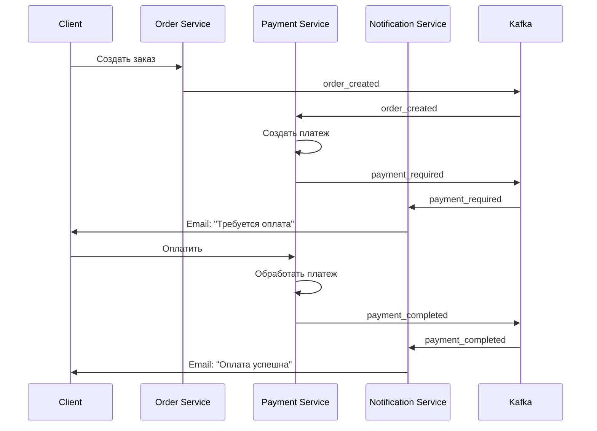

# 🛒 Marketplace - Микросервисная архитектура

Современная платформа электронной коммерции, построенная на микросервисной архитектуре с использованием Go, PostgreSQL и Apache Kafka.

## 🏗️ Архитектура

Проект состоит из 5 независимых микросервисов:

```
┌─────────────────┐    ┌─────────────────┐    ┌─────────────────┐    ┌─────────────────┐    ┌─────────────────┐
│   User Service  │    │ Product Service │    │  Order Service  │    │ Payment Service │    │Notification Svc│
│                 │    │                 │    │                 │    │                 │    │                 │
│ • Регистрация   │    │ • Каталог       │    │ • Создание      │    │ • Создание      │    │ • Email         │
│ • Авторизация   │    │ • Поиск         │    │ • Управление    │    │ • Обработка     │    │ • SMS           │
│ • Профили       │    │ • CRUD          │    │ • Статусы       │    │ • Статусы       │    │ • Push          │
└─────────────────┘    └─────────────────┘    └─────────────────┘    └─────────────────┘    └─────────────────┘
         │                       │                       │                       │                       │
         └───────────────────────┼───────────────────────┼───────────────────────┼───────────────────────┘
                                 │                       │                       │
                    ┌─────────────────┐    ┌─────────────────┐
                    │   PostgreSQL    │    │   Apache Kafka  │
                    │                 │    │                 │
                    │ • Пользователи  │    │ • order-events  │
                    │ • Товары        │    │ • Event-driven  │
                    │ • Заказы        │    │ • Асинхронность │
                    │ • Платежи       │    │ • Уведомления   │
                    └─────────────────┘    └─────────────────┘
```

## 🚀 Основные возможности

### 👤 User Service (Порт: 8081)

- **Регистрация пользователей** с валидацией
- **Авторизация** через JWT токены
- **Управление профилями** (поставщики/клиенты)
- **Валидация токенов** для других сервисов

### 📦 Product Service (Порт: 8082)

- **Каталог товаров** с полным CRUD
- **Поиск и фильтрация** товаров
- **Управление товарами** поставщиками
- **Информация о поставщиках**

### 🛍️ Order Service (Порт: 8084)

- **Создание заказов** клиентами
- **Управление заказами** поставщиками
- **Отслеживание статусов** заказов
- **История заказов** для пользователей
- **Event-driven архитектура** через Kafka

### 💳 Payment Service (Порт: 8083)

- **Создание платежей** при создании заказов
- **Обработка платежей** (карта, банковский перевод, PayPal)
- **Управление статусами** платежей
- **Интеграция с платежными системами**
- **Event-driven уведомления** через Kafka

### 📧 Notification Service (Порт: 8085)

- **Email уведомления** через SMTP
- **SMS уведомления** (мок)
- **Push уведомления** (мок)
- **Асинхронная обработка** событий заказов и платежей
- **Персонализированные сообщения**
- **Уведомления о необходимости оплаты**
- **Уведомления об успешной оплате**

## 🛠️ Технологический стек

### Backend

- **Go 1.21+** - основной язык программирования
- **Gorilla Mux** - HTTP роутинг
- **PostgreSQL** - основная база данных
- **Apache Kafka** - message broker для событий
- **JWT** - аутентификация и авторизация

### Инфраструктура

- **Docker Compose** - контейнеризация и оркестрация
- **Kafka UI** - веб-интерфейс для управления Kafka
- **Zookeeper** - координация Kafka кластера

### Библиотеки

- **github.com/IBM/sarama** - Kafka клиент для Go
- **github.com/golang-jwt/jwt** - JWT токены
- **gopkg.in/gomail.v2** - отправка email
- **github.com/lib/pq** - PostgreSQL драйвер
- **github.com/hashicorp/go-uuid** - генерация UUID

## 📁 Структура проекта

```
marketplace/
├── User_Service/                 # Сервис пользователей
│   ├── cmd/main.go              # Точка входа
│   ├── internal/
│   │   ├── api/                 # HTTP handlers
│   │   ├── models/              # Модели данных
│   │   └── repository/          # Работа с БД
│   └── go.mod
├── Product_Service/              # Сервис товаров
│   ├── cmd/main.go
│   ├── internal/
│   │   ├── api/
│   │   ├── models/
│   │   └── repository/
│   └── go.mod
├── Order_Service/                # Сервис заказов
│   ├── cmd/main.go
│   ├── internal/
│   │   ├── api/
│   │   ├── models/
│   │   ├── repository/
│   │   └── kafka/               # Kafka Producer
│   └── go.mod
├── Payment_Service/              # Сервис платежей
│   ├── cmd/main.go
│   ├── internal/
│   │   ├── api/                 # HTTP handlers
│   │   ├── models/              # Модели данных
│   │   ├── repository/          # Работа с БД
│   │   ├── service/             # Бизнес-логика
│   │   └── kafka/               # Kafka Producer/Consumer
│   └── go.mod
├── Notification_Service/         # Сервис уведомлений
│   ├── cmd/main.go
│   ├── internal/
│   │   ├── models/
│   │   ├── service/             # Email, SMS, Push сервисы
│   │   └── kafka/               # Kafka Consumer
│   └── go.mod
├── docker-compose.yml           # Docker конфигурация
└── README.md
```

## 🚀 Быстрый старт

### 1. Запуск инфраструктуры

```bash
# Запуск Kafka, Zookeeper и Kafka UI
docker-compose up -d

# Проверка статуса
docker-compose ps
```

### 2. Создание топика Kafka

Откройте [Kafka UI](http://localhost:8080) и создайте топик:

- **Название**: `order-events`
- **Партиции**: 3
- **Репликации**: 1

### 3. Настройка базы данных

```bash
# Создание базы данных для платежей
psql -h localhost -U postgres -c "CREATE DATABASE payment_db;"

# Добавление колонки amount в таблицу orders
psql -h localhost -U postgres -d order_db -c "ALTER TABLE orders ADD COLUMN amount DECIMAL(10,2) DEFAULT 0.0;"
```

### 4. Запуск сервисов

```bash
# Терминал 1 - User Service
cd User_Service && go run cmd/main.go

# Терминал 2 - Product Service
cd Product_Service && go run cmd/main.go

# Терминал 3 - Payment Service
cd Payment_Service && go run cmd/main.go

# Терминал 4 - Order Service
cd Order_Service && go run cmd/main.go

# Терминал 5 - Notification Service
cd Notification_Service && go run cmd/main.go
```

## 🧪 Тестирование API

### Регистрация пользователей

```bash
# Регистрация поставщика
curl -X POST http://localhost:8081/api/register \
  -H "Content-Type: application/json" \
  -d '{"username":"supplier1","email":"supplier1@example.com","password":"password123","role":"supplier"}'

# Регистрация клиента
curl -X POST http://localhost:8081/api/register \
  -H "Content-Type: application/json" \
  -d '{"username":"client1","email":"client1@example.com","password":"password123","role":"client"}'
```

### Авторизация

```bash
# Получение JWT токена
curl -X POST http://localhost:8081/api/login \
  -H "Content-Type: application/json" \
  -d '{"email":"supplier1@example.com","password":"password123"}'
```

### Создание товара

```bash
# Создание товара (используйте токен из авторизации)
curl -X POST http://localhost:8082/api/product/create \
  -H "Content-Type: application/json" \
  -H "Authorization: Bearer YOUR_JWT_TOKEN" \
  -d '{"name":"iPhone 15","description":"Latest iPhone","price":999.99,"supplier_id":1}'
```

### Создание заказа

```bash
# Создание заказа (используйте токен клиента)
curl -X POST http://localhost:8084/api/order/create \
  -H "Content-Type: application/json" \
  -H "Authorization: Bearer CLIENT_JWT_TOKEN" \
  -d '{"product_name":"iPhone 15","product_id":1,"supplier_id":1,"amount":999.99}'
```

### Обработка платежа

```bash
# Получение информации о платеже
curl -X GET http://localhost:8083/api/payments/PAYMENT_ID \
  -H "Authorization: Bearer CLIENT_JWT_TOKEN"

# Оплата картой
curl -X POST http://localhost:8083/api/payments/PAYMENT_ID/pay \
  -H "Content-Type: application/json" \
  -H "Authorization: Bearer CLIENT_JWT_TOKEN" \
  -d '{
    "payment_method": "card",
    "card_number": "4111111111111111",
    "expiry_month": 12,
    "expiry_year": 2025,
    "cvv": "123",
    "cardholder_name": "Test User"
  }'

# Оплата банковским переводом
curl -X POST http://localhost:8083/api/payments/PAYMENT_ID/pay \
  -H "Content-Type: application/json" \
  -H "Authorization: Bearer CLIENT_JWT_TOKEN" \
  -d '{
    "payment_method": "bank_transfer",
    "bank_name": "Test Bank",
    "account_number": "1234567890"
  }'
```

## 📊 Event-Driven Architecture

### Полный поток событий

```
1. Клиент создает заказ → Order Service
   ↓
2. Order Service отправляет order_created → Kafka
   ↓
3. Payment Service получает order_created → создает платеж → отправляет payment_required
   ↓
4. Notification Service получает payment_required → отправляет уведомление клиенту
   ↓
5. Клиент оплачивает → Payment Service
   ↓
6. Payment Service отправляет payment_completed → Kafka
   ↓
7. Notification Service получает payment_completed → отправляет уведомление об успешной оплате
```

### Типы событий

- **`order_created`** - новый заказ создан
- **`order_status_updated`** - статус заказа изменен
- **`payment_required`** - требуется оплата заказа
- **`payment_completed`** - платеж успешно завершен

### Схема событий



## 🔧 Конфигурация

### Порты сервисов

- **User Service**: 8081
- **Product Service**: 8082
- **Payment Service**: 8083
- **Order Service**: 8084
- **Notification Service**: 8085
- **Kafka UI**: 8080

### База данных

- **PostgreSQL**: localhost:5432
- **Базы**:
  - `marketplace` (пользователи, товары)
  - `order_db` (заказы)
  - `payment_db` (платежи)
- **Пользователь**: postgres
- **Пароль**: password

### Kafka

- **Broker**: localhost:9092
- **Zookeeper**: localhost:2181
- **Топик**: order-events

## 📧 Настройка уведомлений

### Email (Gmail)

```go
// В Notification_Service/cmd/main.go
emailService := service.NewEmailService(
    "smtp.gmail.com",           // SMTP host
    587,                        // SMTP port
    "your-email@gmail.com",     // SMTP username
    "your-app-password",        // SMTP password (App Password)
    "noreply@marketplace.com",  // From email
)
```

### SMS и Push (мок)

По умолчанию используются мок-сервисы для демонстрации. Для продакшена замените на реальные API:

- **SMS**: Twilio, Nexmo, SMS.ru
- **Push**: Firebase Cloud Messaging, Apple Push Notification Service

## 🐳 Docker

### Запуск всей инфраструктуры

```bash
docker-compose up -d
```

### Остановка

```bash
docker-compose down
```

### Логи

```bash
docker-compose logs -f kafka
```

## 📈 Мониторинг

### Kafka UI

- **URL**: http://localhost:8080
- **Функции**: просмотр топиков, сообщений, consumer groups

### Логи сервисов

Каждый сервис логирует:

- HTTP запросы
- Ошибки базы данных
- Kafka события
- Уведомления
- Платежные операции

## 🔒 Безопасность

- **JWT токены** для аутентификации
- **TLS шифрование** для SMTP
- **Валидация входных данных**
- **Обработка ошибок**
- **Локальная JWT валидация** (без HTTP запросов)

## 🚀 Развертывание

### Локальная разработка

1. Установите Go 1.21+
2. Установите Docker и Docker Compose
3. Клонируйте репозиторий
4. Запустите `docker-compose up -d`
5. Настройте базы данных
6. Запустите сервисы по очереди

### Продакшен

- Используйте Kubernetes или Docker Swarm
- Настройте мониторинг (Prometheus, Grafana)
- Настройте логирование (ELK Stack)
- Используйте внешние базы данных и Kafka кластеры
- Настройте реальные платежные системы

## 🤝 Вклад в проект

1. Fork репозитория
2. Создайте feature branch
3. Внесите изменения
4. Добавьте тесты
5. Создайте Pull Request

## 📝 Лицензия

MIT License

## 👥 Авторы

- **Разработчик**: [Ваше имя]
- **Архитектура**: Микросервисы + Event-Driven
- **Технологии**: Go, PostgreSQL, Kafka, Docker

---

**Marketplace** - современная платформа электронной коммерции с микросервисной архитектурой и системой платежей! 🛒💳✨
